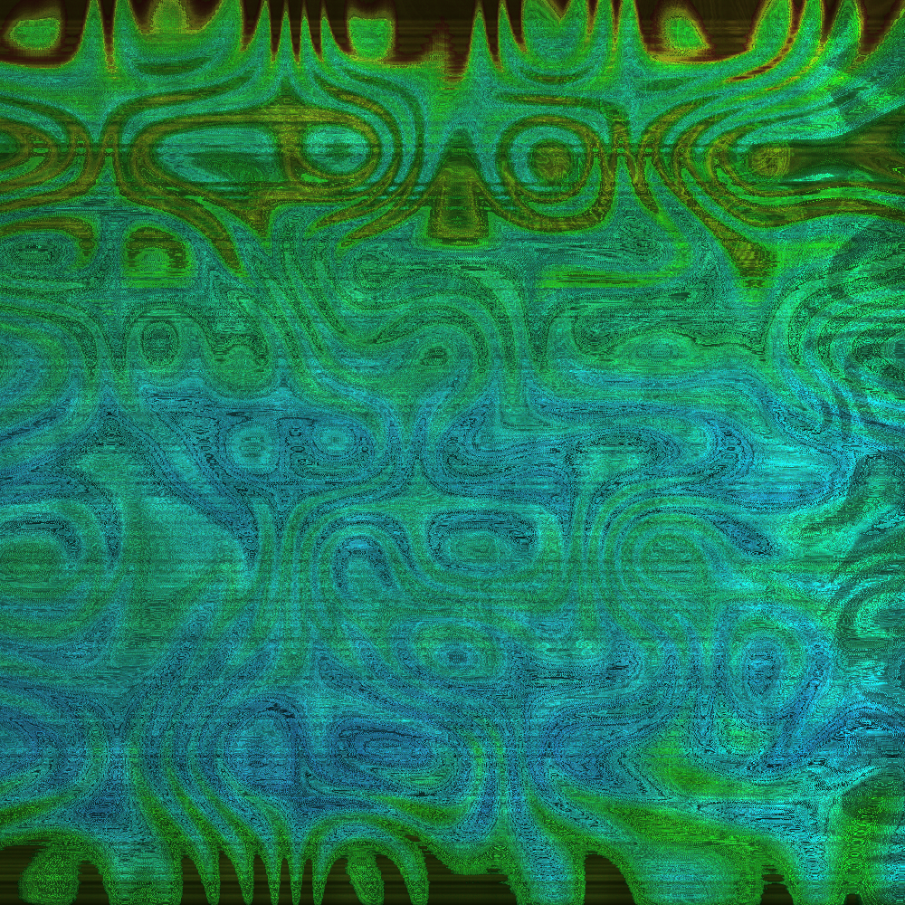
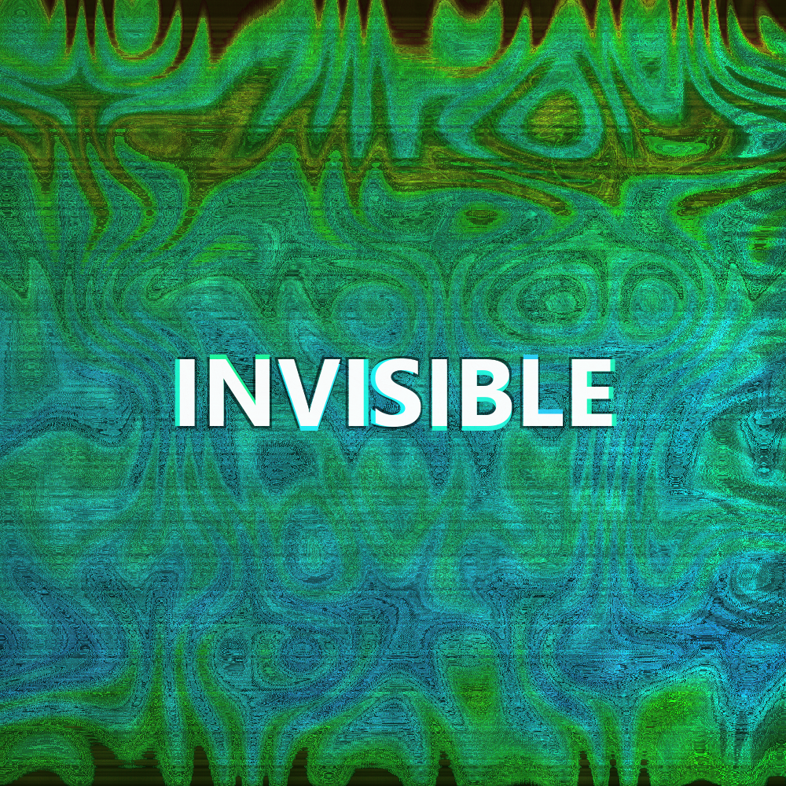

# Music2Picture

Генерация обложек из музыки и встраивание картинки в MP3.

[English version](#engver)

## Что умеет проект

Проект создаёт картинку-обложку из самой песни:

```text
1000x1000 PNG
случайный музыкальный узор
цвета на основе BPM
опциональная надпись с названием файла
опциональное встраивание картинки как обложки MP3
```

Главный файл:

```text
music2picture.py
```

## Примеры результата

В папке `example` лежат три тестовые песни и готовые обложки:

```text
example/Im so sorry.mp3
example/Into Yesterday.mp3
example/INVISIBLE.mp3
```

Для каждой песни есть две версии:

```text
covers_no_title   -> только рисунок
covers_with_title -> рисунок с названием файла по центру
```

| Песня | Без надписи | С надписью |
|---|---|---|
| Im so sorry |  |  |
| Into Yesterday |  |  |
| INVISIBLE |  |  |

## Установка FFmpeg

Скрипту нужен FFmpeg. Он должен быть доступен из PowerShell или PyCharm.

Официальная страница:

```text
https://ffmpeg.org/download.html
```

Для Windows можно использовать сборки:

```text
https://www.gyan.dev/ffmpeg/builds/
```

Обычно достаточно скачать `release essentials`, распаковать, например, в:

```text
C:\ffmpeg
```

и добавить в `Path` папку:

```text
C:\ffmpeg\bin
```

Проверка:

```powershell
ffmpeg -version
ffprobe -version
```

Если обе команды показывают версию, всё готово.

## Python-зависимости

Нужны:

```text
numpy
Pillow
```

Установка:

```powershell
pip install numpy pillow
```

## Как запустить из командной строки

Перейдите в папку проекта:

```powershell
cd "C:\Path\To\Music2Picture"
```

### Создать обложку для одной песни

Без надписи, только рисунок:

```powershell
python .\music2picture.py covers --source "C:\Music\song.mp3" --output "C:\Music\covers"
```

С надписью по центру:

```powershell
python .\music2picture.py covers --source "C:\Music\song.mp3" --output "C:\Music\covers" --center-title
```

С надписью и привязкой картинки к MP3:

```powershell
python .\music2picture.py covers --source "C:\Music\song.mp3" --output "C:\Music\covers" --center-title --embed-cover
```

### Создать обложки для всех песен в папке

Только PNG:

```powershell
python .\music2picture.py covers --source "C:\Music\Input" --output "C:\Music\covers"
```

PNG + надписи:

```powershell
python .\music2picture.py covers --source "C:\Music\Input" --output "C:\Music\covers" --center-title
```

PNG + надписи + встраивание в MP3:

```powershell
python .\music2picture.py covers --source "C:\Music\Input" --output "C:\Music\covers" --center-title --embed-cover
```

Флаг `--embed-cover` изменяет MP3-файл: созданная картинка становится его обложкой. Если флаг не указан, MP3 не меняется.

## Как запустить из PyCharm

Откройте `music2picture.py`.

В начале файла есть блок:

```python
RUN_FROM_CODE = False
CODE_MODE = "covers"
CODE_SOURCE = r"C:\Path\To\MusicOrSong.mp3"
CODE_OUTPUT = r"C:\Path\To\OutputFolder"

CODE_SIZE = 1000
CODE_PATTERNS = 2
CODE_CENTER_TITLE = True
CODE_EMBED_COVER = False
```

Чтобы запускать прямо кнопкой Run:

1. Поставьте:

```python
RUN_FROM_CODE = True
```

2. Укажите файл или папку:

```python
CODE_SOURCE = r"C:\Music\song.mp3"
```

или:

```python
CODE_SOURCE = r"C:\Music\InputFolder"
```

3. Укажите папку для картинок:

```python
CODE_OUTPUT = r"C:\Music\covers"
```

4. Выберите, нужна ли надпись:

```python
CODE_CENTER_TITLE = True   # с надписью
CODE_CENTER_TITLE = False  # только рисунок
```

5. Выберите, встраивать ли обложку в MP3:

```python
CODE_EMBED_COVER = True   # встроить картинку в MP3
CODE_EMBED_COVER = False  # только сохранить PNG
```

6. Нажмите Run в PyCharm.

## Как создаётся рисунок

Рисунок строится из аудиоданных песни.

### 1. Декодирование аудио

FFmpeg декодирует песню в моно-сигнал.

### 2. Анализ частот

Скрипт делает спектральный анализ:

```text
низкие частоты
средние частоты
высокие частоты
громкость по времени
пики громкости
```

Эти данные управляют формой узора.

### 3. BPM по 15-секундным отрезкам

Для цвета используется не один общий цвет на всю картинку.

Скрипт делит песню на 15-секундные отрезки, считает пики баса и оценивает BPM:

```text
BPM = количество ударов баса за 15 секунд * 4
```

### 4. Случайный BPM для каждого пикселя

Каждый пиксель получает свой случайный BPM рядом с BPM текущего отрезка.

Среднее значение остаётся около BPM отрезка, но отдельные пиксели немного отличаются. Поэтому картинка не становится одним плоским цветом.

### 5. Цвета

Цвет зависит от BPM:

```text
ближе к 30 BPM  -> красная зона
ближе к 240 BPM -> фиолетовая зона
```

Дополнительно частоты и громкость влияют на:

```text
яркость
насыщенность
контраст
видимость узора
```

### 6. Узоры

Основной рисунок создаётся случайным полем, которое меняется при каждом запуске.

При этом узор не полностью случайный:

```text
громкие пики делают узор заметнее
басы влияют на крупные формы
высокие частоты добавляют детализацию
спектр песни влияет на яркость и плотность
```

`--patterns 1` делает узор проще.

`--patterns 2` добавляет второй слой и делает рисунок богаче.

## Как работает надпись

Если включить `--center-title`, в центр картинки добавляется имя файла.

Логика:

1. В центре картинки есть невидимый квадрат.
2. Текст должен поместиться внутри него.
3. Если название длинное, оно переносится на несколько строк.
4. Размер шрифта увеличивается до тех пор, пока текст почти не коснётся границ квадрата.
5. Сам квадрат не рисуется.
6. Белые буквы получают равномерную тень.
7. У каждой буквы есть цветная грань с одной случайной стороны.
8. Цвет грани берётся из самой музыкальной картинки.

## Встраивание обложки в MP3

Флаг:

```text
--embed-cover
```

делает созданный PNG обложкой MP3-файла.

Пример:

```powershell
python .\music2picture.py covers --source "C:\Music\song.mp3" --output "C:\Music\covers" --center-title --embed-cover
```

Если `--embed-cover` не указан, скрипт только создаёт PNG и не меняет аудиофайл.

## Поддерживаемые форматы входа

```text
.mp3
.flac
.wav
.m4a
.aac
.ogg
.opus
.wma
```

Встраивание обложки поддерживается только для `.mp3`.

## Примеры команд

Одна песня, только рисунок:

```powershell
python .\music2picture.py covers --source "C:\Music\AIZO.mp3" --output "C:\Music\covers"
```

Одна песня, рисунок с названием:

```powershell
python .\music2picture.py covers --source "C:\Music\AIZO.mp3" --output "C:\Music\covers" --center-title
```

Одна песня, рисунок с названием и встраиванием:

```powershell
python .\music2picture.py covers --source "C:\Music\AIZO.mp3" --output "C:\Music\covers" --center-title --embed-cover
```

Вся папка:

```powershell
python .\music2picture.py covers --source "C:\Music\Input" --output "C:\Music\covers" --center-title
```

>**Автор проекта Зейналов У.Р.о.**
---
<h2 id = engver>
 English Version
</h2>

Audio-based cover generation and optional MP3 cover embedding.

Main file:

```text
music2picture.py
```

## Features

The project generates cover art from audio:

```text
1000x1000 PNG
random audio-based pattern
BPM-based colors
optional centered file name
optional MP3 cover embedding
```

## Examples

The `example` folder contains three test songs and generated covers:

```text
example/Im so sorry.mp3
example/Into Yesterday.mp3
example/INVISIBLE.mp3
```

Each song has two generated versions:

```text
covers_no_title   -> artwork only
covers_with_title -> artwork with the file name in the center
```

| Song | Without Title | With Title |
|---|---|---|
| Im so sorry |  |  |
| Into Yesterday |  |  |
| INVISIBLE |  |  |

## FFmpeg Installation

FFmpeg is required.

Official page:

```text
https://ffmpeg.org/download.html
```

Windows builds:

```text
https://www.gyan.dev/ffmpeg/builds/
```

Download `release essentials`, extract it, and add the `bin` folder to `Path`, for example:

```text
C:\ffmpeg\bin
```

Check:

```powershell
ffmpeg -version
ffprobe -version
```

## Python Requirements

```powershell
pip install numpy pillow
```

## Command Line Usage

Go to the project folder:

```powershell
cd "C:\Path\To\Music2Picture"
```

Generate a cover for one song:

```powershell
python .\music2picture.py covers --source "C:\Music\song.mp3" --output "C:\Music\covers"
```

Generate a cover with centered text:

```powershell
python .\music2picture.py covers --source "C:\Music\song.mp3" --output "C:\Music\covers" --center-title
```

Generate and embed the cover into the MP3:

```powershell
python .\music2picture.py covers --source "C:\Music\song.mp3" --output "C:\Music\covers" --center-title --embed-cover
```

Generate covers for a whole folder:

```powershell
python .\music2picture.py covers --source "C:\Music\Input" --output "C:\Music\covers" --center-title
```

## PyCharm Usage

Open `music2picture.py`.

At the top of the file, edit:

```python
RUN_FROM_CODE = True
CODE_MODE = "covers"
CODE_SOURCE = r"C:\Music\song.mp3"
CODE_OUTPUT = r"C:\Music\covers"
CODE_CENTER_TITLE = True
CODE_EMBED_COVER = False
```

Then press Run in PyCharm.

Use:

```python
CODE_CENTER_TITLE = False
```

to generate only the artwork without text.

Use:

```python
CODE_EMBED_COVER = True
```

to attach the generated PNG as the MP3 cover image.

## How The Artwork Is Generated

The image is based on the song audio.

1. FFmpeg decodes the song to mono audio.
2. The script calculates a frequency spectrum.
3. It extracts bass, mids, highs, loudness, and peaks.
4. The song is split into 15-second windows.
5. Bass peaks are counted in each window.
6. Local BPM is estimated as:

```text
BPM = bass hits in 15 seconds * 4
```

Each pixel gets a random BPM near the local BPM of its time section. The average stays close to the local BPM, but individual pixels vary slightly.

Color mapping:

```text
near 30 BPM  -> red
near 240 BPM -> violet
```

Frequencies and loudness affect brightness, saturation, contrast, and pattern visibility.

## Patterns

The pattern is generated from random fields and audio features.

It changes on every run, but still follows the song:

```text
loud peaks make the pattern stronger
bass controls large forms
high frequencies add detail
the spectrum controls brightness and density
```

Use:

```text
--patterns 1
```

for a simpler pattern.

Use:

```text
--patterns 2
```

for a richer pattern.

## Center Text

With `--center-title`, the file name is drawn in the center.

The text is fitted into an invisible center square:

```text
long titles wrap to multiple lines
font size grows until the text nearly touches the square boundary
the square itself is not drawn
letters are white
each letter has a colored side edge sampled from the artwork
```

## MP3 Cover Embedding

Use:

```text
--embed-cover
```

to attach the generated image as the MP3 cover art.

Without this flag, the script only saves PNG files and does not modify MP3 files.

## Supported Input Formats

```text
.mp3
.flac
.wav
.m4a
.aac
.ogg
.opus
.wma
```

Cover embedding is only supported for `.mp3`.

> **The author of the project : Zeynalov U.R.o.**
