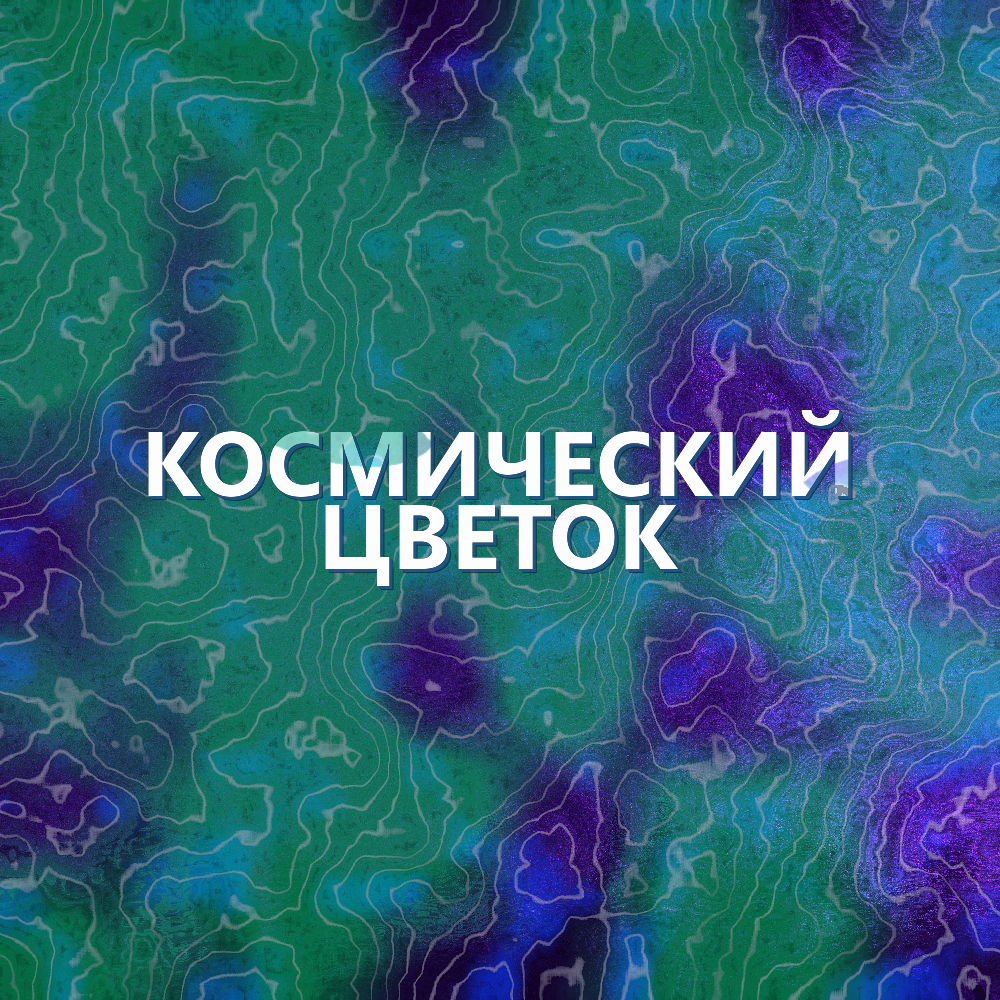

# Music2Picture

[English Version](#engG1)

Music2Picture создает квадратные PNG-обложки из аудиофайлов. Картинка строится по спектру, громкости, басу, верхам, локальной энергии и BPM песни. Название трека рисуется по центру по умолчанию.

Основной файл:

```text
music2picture.py
```

## Возможности

- Генерация обложек `1000x1000` для одного трека или папки с музыкой.
- Четыре режима цвета и характера: `Ocean`, `Plasma`, `Fusion`, `Aurora`.
- Короткие алиасы режимов: `O`, `D`, `F`, `A`.
- Повторяемый результат через `--seed`.
- Текст по центру включен по умолчанию.
- Опциональное встраивание PNG как обложки MP3 через FFmpeg.

## Режимы

| Режим | Алиас | Что делает |
|---|---:|---|
| `Ocean` | `O` | Цвет строится от BPM и музыкального движения. Это бывший `bpm`. |
| `Plasma` | `D` | Энергичный режим с диагональным движением и контрастными акцентами. Это бывший `drive`. |
| `Fusion` | `F` | Органический режим по характеру песни: энергия, бас, середина, верха. |
| `Aurora` | `A` | Основан на `Fusion`, но добавляет мягкие северные переливы и световые ленты. |

## Пример режимов

Одна случайно выбранная песня из коллекции: `Космический цветок.mp3`.

<audio controls>
  <source src="https://github.com/dumuzeyn/Music2Picture/blob/main/example/modes/%D0%9A%D0%BE%D1%81%D0%BC%D0%B8%D1%87%D0%B5%D1%81%D0%BA%D0%B8%D0%B9%20%D1%86%D0%B2%D0%B5%D1%82%D0%BE%D0%BA.mp3" type="audio/mpeg">
  Ваш браузер не поддерживает встроенный аудиоплеер.
</audio>

| Ocean | Plasma |
|---|---|
|  |  |

| Fusion | Aurora |
|---|---|
|  |  |

## Установка

Нужны Python-зависимости:

```powershell
pip install numpy pillow
```

Также нужен FFmpeg и FFprobe в `PATH`:

```powershell
ffmpeg -version
ffprobe -version
```

## Генерация

Сгенерировать обложку для одного файла:

```powershell
python .\music2picture.py covers --source "C:\Music\song.mp3" --output "C:\Music\covers" --color-mode aurora --seed 42
```

Сгенерировать обложки для всей папки:

```powershell
python .\music2picture.py covers --source "C:\Music\Input" --output "C:\Music\covers" --color-mode plasma --seed 42
```

Использовать короткий алиас режима:

```powershell
python .\music2picture.py covers --source "C:\Music\song.mp3" --output "C:\Music\covers" --color-mode A
```

Сгенерировать без текста:

```powershell
python .\music2picture.py covers --source "C:\Music\song.mp3" --output "C:\Music\covers" --no-center-title
```

Встроить картинку как обложку MP3:

```powershell
python .\music2picture.py covers --source "C:\Music\song.mp3" --output "C:\Music\covers" --embed-cover
```

## Текст

Текст включен по умолчанию. Используется имя файла без расширения.

Особенности текста:

- автоматический перенос слов на несколько строк;
- центрирование всего блока надписи по центру картинки;
- единая тень в одном направлении;
- большая часть букв остается белой;
- внутри букв могут появляться редкие рваные фрагменты цвета фона.

## Настройки из кода

Можно включить запуск прямо из файла:

```python
RUN_FROM_CODE = True
CODE_MODE = "covers"
CODE_SOURCE = r"C:\Music\song.mp3"
CODE_OUTPUT = r"C:\Music\covers"
CODE_COLOR_MODE = "aurora"
CODE_CENTER_TITLE = True
CODE_SEED = 42
```

## Команды CLI

```text
process  - нормализация музыки через FFmpeg
covers   - генерация PNG-обложек
```

Основные параметры `covers`:

```text
--source          файл или папка с музыкой
--output          папка для PNG
--size            размер изображения, по умолчанию 1000
--patterns        1 или 2, богатство узора
--color-mode      ocean/plasma/fusion/aurora или O/D/F/A
--seed            фиксирует случайность
--center-title    текст по центру, включен по умолчанию
--no-center-title отключает текст
--embed-cover     встроить PNG в MP3
```

> **Автор проекта: Зейналов У.Р.о.**
--- 
<h1 id = engG1>
Music2Picture
</h1>

Music2Picture creates square PNG covers from audio files. The picture is based on the spectrum, volume, bass, tops, local energy and BPM of the song. The track name is drawn in the center by default.

The main file:

```text
music2picture.py
```

## Features

- Generate `1000x1000` covers for a single track or music folder.
- Four color and character modes: `Ocean', `Plasma', `Fusion', `Aurora'.
- Short aliases of modes: `O`, `D`, `F`, `A`.
- Repeatable result via `--seed'.
- The text in the center is enabled by default.
- Optional embedding of PNG as an MP3 cover via FFmpeg.

## Modes

| Mode | Alias | What does |
|---|---:|---|
| `Ocean` | `O` | The color is based on BPM and musical movement. This is the former `bpm`. |
| `Plasma` | `D` | Energetic mode with diagonal movement and contrasting accents. This is the former `drive`. |
| `Fusion` | `F` | Organic mode by the nature of the song: energy, bass, middle, top. |
| `Aurora` | `A` | It is based on `Fusion`, but adds soft northern iridescences and light ribbons. |


## Example modes

One randomly selected song from the collection: `Cosmic Flower.mp3'.

<audio controls>
  <source src="https://github.com/dumuzeyn/Music2Picture/blob/main/example/modes/%D0%9A%D0%BE%D1%81%D0%BC%D0%B8%D1%87%D0%B5%D1%81%D0%BA%D0%B8%D0%B9%20%D1%86%D0%B2%D0%B5%D1%82%D0%BE%D0%BA.mp3" type="audio/mpeg">
  Ваш браузер не поддерживает встроенный аудиоплеер.
</audio>

| Ocean | Plasma |
|---|---|
|  |  |

| Fusion | Aurora |
|---|---|
|  |  |

## Installation

Python dependencies are needed:

```powershell
pip install numpy pillow
```

FFmpeg and FFprobe are also needed in the `PATH`:

```powershell
ffmpeg -version
ffprobe -version
```

## Generation

Generate a cover for a single file:

```powershell
python .\music2picture.py covers --source "C:\Music\song.mp3" --output "C:\Music\covers" --color-mode aurora --seed 42
```

Generate covers for the entire folder:

```powershell
python .\music2picture.py covers --source "C:\Music\Input" --output "C:\Music\covers" --color-mode plasma --seed 42
```

Use a short mode alias:

```powershell
python .\music2picture.py covers --source "C:\Music\song.mp3" --output "C:\Music\covers" --color-mode A
```

Generate without text:

```powershell
python .\music2picture.py covers --source "C:\Music\song.mp3" --output "C:\Music\covers" --no-center-title
```

Embed an image as an MP3 cover:

```powershell
python .\music2picture.py covers --source "C:\Music\song.mp3" --output "C:\Music\covers" --embed-cover
```

## Text

The text is enabled by default. The file name is used without an extension.

Features of the text:

- automatic word wrapping on several lines;
- centering the entire caption block in the center of the image;
- a single shadow in one direction;
- most of the letters remain white;
- rare torn fragments of the background color may appear inside the letters.

## Settings from the code

You can enable startup directly from the file.:

```python
RUN_FROM_CODE = True
CODE_MODE = "covers"
CODE_SOURCE = r"C:\Music\song.mp3"
CODE_OUTPUT = r"C:\Music\covers"
CODE_COLOR_MODE = "aurora"
CODE_CENTER_TITLE = True
CODE_SEED = 42
```

## CLI Commands

```text
process - normalization of music via FFmpeg
covers - generation of PNG covers
```

The main parameters of `covers`:

```text
--source a file or folder with music
--output folder for PNG
--size the size of the image, by default 1000
--patterns 1 or 2, richness of the pattern
--color-mode ocean/plasma/fusion/aurora or O/D/F/A
--seed captures randomness
--center-title text centered, enabled by default
--no-center-title disables text
--embed-cover to embed PNG in MP3
```
>**Author of project: Zeynalov U.R.o.**